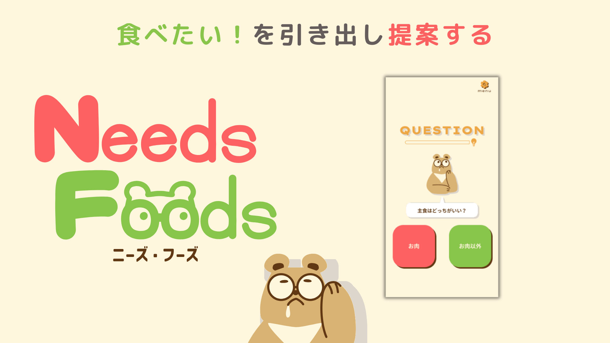
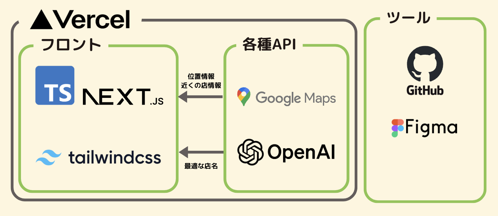

# NeedsFoods



### 背景

外食をするつもりが自分が何を食べたい気分なのか分からない

### 課題

条件が多すぎて、自分のNeedsが分からない

### 提供したい価値

- 外食のUXの向上（始まりから終わりまで）
- 簡単さ（煩わしさの排除）

### アプローチ

質問に回答してもらうことでユーザーのNeedsを引き出す

### 優位性

- Needsの引き出しから店舗の決定まで一貫したやつはない
- 受動的に質問に答えるだけで店をレコメンドしてくれる
    - 意思決定のハードルが低い
- レコメンドを0から行うことができる

## 特徴
- 質問に答えるだけで、お店の提案をしてくれる
- スマホユーザー向けの簡単なUI
- 「外食に行きたい」から「来店」までを一貫してサポート

## システム構成図


## 動作手順

```bash
npm run dev
# or
yarn dev
# or
pnpm dev
# or
bun dev
```

ブラウザで [http://localhost:3000](http://localhost:3000) を開く。
